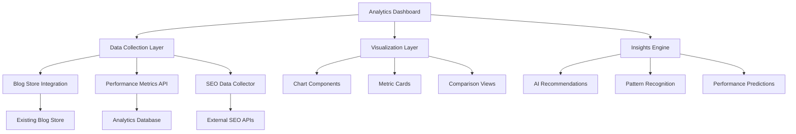

# Design Document

## Overview

The Blog Analytics Dashboard is a comprehensive performance tracking and insights system that integrates seamlessly with the existing ContentCraft AI blog creation platform. The design leverages the current UI patterns, component library (Radix UI + Tailwind CSS), and navigation structure while introducing new analytics-specific components and visualizations.

The analytics system follows the established design language of the application, using the existing sidebar navigation, card-based layouts, and consistent spacing patterns. It provides both high-level overview metrics and detailed drill-down capabilities for individual blog post performance analysis.

## Architecture

### System Architecture



### Component Architecture

The analytics system extends the existing component structure:

```
src/
├── app/(app)/analytics/
│   ├── page.tsx                    # Main analytics dashboard
│   ├── [blogId]/
│   │   └── page.tsx               # Individual blog analytics
│   └── compare/
│       └── page.tsx               # Blog comparison view
├── components/analytics/
│   ├── dashboard/
│   │   ├── overview-cards.tsx     # Key metrics cards
│   │   ├── performance-chart.tsx  # Main performance visualization
│   │   └── recent-posts-table.tsx # Recent posts performance
│   ├── individual/
│   │   ├── blog-metrics.tsx       # Individual blog metrics
│   │   ├── seo-performance.tsx    # SEO-specific metrics
│   │   └── engagement-timeline.tsx # Engagement over time
│   ├── comparison/
│   │   ├── blog-selector.tsx      # Multi-select blog picker
│   │   └── comparison-chart.tsx   # Side-by-side comparison
│   └── shared/
│       ├── metric-card.tsx        # Reusable metric display
│       ├── date-range-picker.tsx  # Date filtering
│       └── export-button.tsx     # Data export functionality
├── lib/analytics/
│   ├── analytics-store.ts         # Analytics data management
│   ├── metrics-calculator.ts      # Performance calculations
│   └── insights-generator.ts     # AI-powered insights
└── types/analytics.ts             # Analytics type definitions
```

## Components and Interfaces

### Core Components

#### 1. Analytics Dashboard Layout

**Component:** `AnalyticsDashboard`
- **Purpose:** Main container for analytics interface
- **Layout:** Follows existing app layout with sidebar navigation
- **Features:**
  - Date range selector in header
  - Grid layout for metric cards
  - Tabbed interface for different views (Overview, Individual Posts, Comparisons)

#### 2. Overview Cards Component

**Component:** `OverviewCards`
- **Purpose:** Display key performance indicators
- **Design:** Card-based layout matching existing UI patterns
- **Metrics Displayed:**
  - Total blog posts published
  - Total views across all posts
  - Average engagement rate
  - Top performing post
  - Recent performance trend

#### 3. Performance Chart Component

**Component:** `PerformanceChart`
- **Purpose:** Visualize performance trends over time
- **Technology:** Recharts (already included in dependencies)
- **Chart Types:**
  - Line chart for views over time
  - Bar chart for engagement by post
  - Area chart for cumulative performance
- **Interactions:**
  - Hover tooltips with detailed metrics
  - Click to drill down to specific time periods
  - Toggle between different metrics

#### 4. Individual Blog Analytics

**Component:** `IndividualBlogAnalytics`
- **Purpose:** Detailed view for single blog post performance
- **Layout:** Two-column layout with metrics and visualizations
- **Features:**
  - Performance timeline
  - SEO metrics breakdown
  - Engagement statistics
  - Optimization recommendations

#### 5. Blog Comparison Interface

**Component:** `BlogComparison`
- **Purpose:** Side-by-side comparison of multiple blog posts
- **Features:**
  - Multi-select blog picker with search and filtering
  - Comparison table with sortable columns
  - Visual indicators for performance differences
  - Export comparison data

### Data Interfaces

#### Analytics Data Types

```typescript
interface BlogAnalytics {
  blogId: string;
  title: string;
  publishedAt: string;
  metrics: {
    views: number;
    uniqueViews: number;
    averageReadTime: number;
    bounceRate: number;
    engagementRate: number;
    socialShares: number;
    comments: number;
  };
  seoMetrics: {
    organicTraffic: number;
    keywordRankings: KeywordRanking[];
    searchVisibility: number;
    clickThroughRate: number;
  };
  performanceHistory: PerformanceDataPoint[];
  lastUpdated: string;
}

interface PerformanceDataPoint {
  timestamp: string;
  views: number;
  engagement: number;
  traffic: number;
}

interface KeywordRanking {
  keyword: string;
  position: number;
  searchVolume: number;
  difficulty: number;
}

interface AnalyticsInsight {
  type: 'recommendation' | 'alert' | 'trend';
  title: string;
  description: string;
  impact: 'high' | 'medium' | 'low';
  actionable: boolean;
  relatedBlogIds: string[];
}
```

## Data Models

### Analytics Store Extension

The analytics system extends the existing blog store with performance tracking capabilities:

```typescript
interface AnalyticsStore {
  // Core analytics data
  blogAnalytics: Map<string, BlogAnalytics>;
  aggregatedMetrics: AggregatedMetrics;
  insights: AnalyticsInsight[];
  
  // Methods
  getBlogAnalytics(blogId: string): BlogAnalytics | undefined;
  getAggregatedMetrics(dateRange?: DateRange): AggregatedMetrics;
  updateBlogMetrics(blogId: string, metrics: Partial<BlogAnalytics>): void;
  generateInsights(): AnalyticsInsight[];
  exportAnalyticsData(format: 'csv' | 'json' | 'pdf'): Promise<Blob>;
  
  // Real-time updates
  subscribeToMetrics(callback: (metrics: AggregatedMetrics) => void): () => void;
  startRealTimeTracking(blogId: string): void;
  stopRealTimeTracking(blogId: string): void;
}
```

### Integration with Existing Blog Store

The analytics system integrates with the existing blog store by:

1. **Extending BlogPost Interface:**
   ```typescript
   interface BlogPost {
     // ... existing properties
     analytics?: {
       isTrackingEnabled: boolean;
       lastAnalyticsUpdate: string;
       performanceSummary: {
         totalViews: number;
         engagementRate: number;
         seoScore: number;
       };
     };
   }
   ```

2. **Event Listeners:** Subscribe to blog store changes to automatically start tracking new posts

3. **Data Synchronization:** Periodic sync between blog content and analytics data

## Error Handling

### Error Scenarios and Handling

1. **Analytics Data Unavailable:**
   - Display skeleton loaders during data fetching
   - Show appropriate empty states with helpful messaging
   - Provide retry mechanisms for failed requests

2. **Real-time Updates Failure:**
   - Graceful degradation to periodic updates
   - User notification of connection issues
   - Automatic reconnection attempts

3. **Export Failures:**
   - Progress indicators for long-running exports
   - Error messages with specific failure reasons
   - Alternative export format suggestions

4. **SEO Data Integration Issues:**
   - Fallback to basic metrics when external APIs fail
   - Clear indication of missing data sources
   - Manual data entry options for critical metrics

### Error UI Components

```typescript
interface ErrorBoundaryProps {
  fallback: React.ComponentType<{ error: Error; retry: () => void }>;
  onError?: (error: Error) => void;
}

// Specific error states
const AnalyticsErrorStates = {
  NoData: () => <EmptyState message="No analytics data available" />,
  LoadingError: ({ retry }: { retry: () => void }) => (
    <ErrorCard message="Failed to load analytics" onRetry={retry} />
  ),
  ExportError: ({ error }: { error: string }) => (
    <Toast variant="destructive" title="Export failed" description={error} />
  ),
};
```

## Testing Strategy

### Unit Testing

1. **Component Testing:**
   - Test all analytics components with React Testing Library
   - Mock analytics data for consistent testing
   - Test user interactions (filtering, sorting, exporting)

2. **Store Testing:**
   - Test analytics store methods and state management
   - Test data transformation and calculation functions
   - Test integration with existing blog store

3. **Utility Testing:**
   - Test metrics calculation functions
   - Test date range handling and formatting
   - Test export functionality

### Integration Testing

1. **API Integration:**
   - Test analytics data fetching and caching
   - Test real-time update mechanisms
   - Test error handling for API failures

2. **Component Integration:**
   - Test data flow between components
   - Test navigation between analytics views
   - Test responsive behavior across screen sizes

3. **Store Integration:**
   - Test analytics store integration with blog store
   - Test data synchronization and consistency
   - Test performance with large datasets

### End-to-End Testing

1. **User Workflows:**
   - Test complete analytics viewing workflow
   - Test blog comparison functionality
   - Test data export processes

2. **Performance Testing:**
   - Test dashboard loading times with various data sizes
   - Test real-time update performance
   - Test memory usage with long-running sessions

3. **Cross-browser Testing:**
   - Test chart rendering across different browsers
   - Test responsive design on various devices
   - Test accessibility compliance

### Testing Tools and Setup

```typescript
// Test utilities
export const mockAnalyticsData = {
  blogAnalytics: new Map([
    ['1', {
      blogId: '1',
      title: 'Test Blog Post',
      metrics: {
        views: 1500,
        uniqueViews: 1200,
        averageReadTime: 180,
        bounceRate: 0.35,
        engagementRate: 0.65,
        socialShares: 25,
        comments: 8,
      },
      // ... more mock data
    }],
  ]),
};

// Component test helpers
export const renderWithAnalyticsProvider = (
  component: React.ReactElement,
  initialData = mockAnalyticsData
) => {
  return render(
    <AnalyticsProvider initialData={initialData}>
      {component}
    </AnalyticsProvider>
  );
};
```

## Performance Considerations

### Data Management

1. **Lazy Loading:** Load analytics data only when analytics pages are accessed
2. **Caching Strategy:** Implement intelligent caching for frequently accessed metrics
3. **Data Pagination:** Paginate large datasets to improve initial load times
4. **Background Updates:** Use web workers for heavy calculations

### Rendering Optimization

1. **Virtual Scrolling:** For large lists of blog posts in comparison views
2. **Chart Optimization:** Use canvas-based rendering for complex visualizations
3. **Memoization:** Memoize expensive calculations and component renders
4. **Code Splitting:** Split analytics code into separate bundles

### Real-time Updates

1. **WebSocket Connection:** Efficient real-time data updates
2. **Debounced Updates:** Prevent excessive re-renders from frequent updates
3. **Selective Updates:** Update only changed metrics rather than full refresh
4. **Connection Management:** Intelligent connection handling and reconnection

## Accessibility

### WCAG Compliance

1. **Keyboard Navigation:** Full keyboard accessibility for all interactive elements
2. **Screen Reader Support:** Proper ARIA labels and descriptions for charts and metrics
3. **Color Accessibility:** Ensure sufficient color contrast and don't rely solely on color
4. **Focus Management:** Clear focus indicators and logical tab order

### Chart Accessibility

1. **Alternative Text:** Descriptive alt text for all visualizations
2. **Data Tables:** Provide tabular alternatives to chart data
3. **Keyboard Interaction:** Allow keyboard navigation through chart data points
4. **Voice Announcements:** Announce important metric changes

### Implementation

```typescript
// Accessible chart component example
const AccessibleChart = ({ data, title, description }) => {
  return (
    <div role="img" aria-labelledby="chart-title" aria-describedby="chart-desc">
      <h3 id="chart-title">{title}</h3>
      <p id="chart-desc" className="sr-only">{description}</p>
      <ResponsiveContainer>
        <LineChart data={data}>
          {/* Chart implementation */}
        </LineChart>
      </ResponsiveContainer>
      <table className="sr-only">
        <caption>Data table for {title}</caption>
        {/* Tabular representation of chart data */}
      </table>
    </div>
  );
};
```